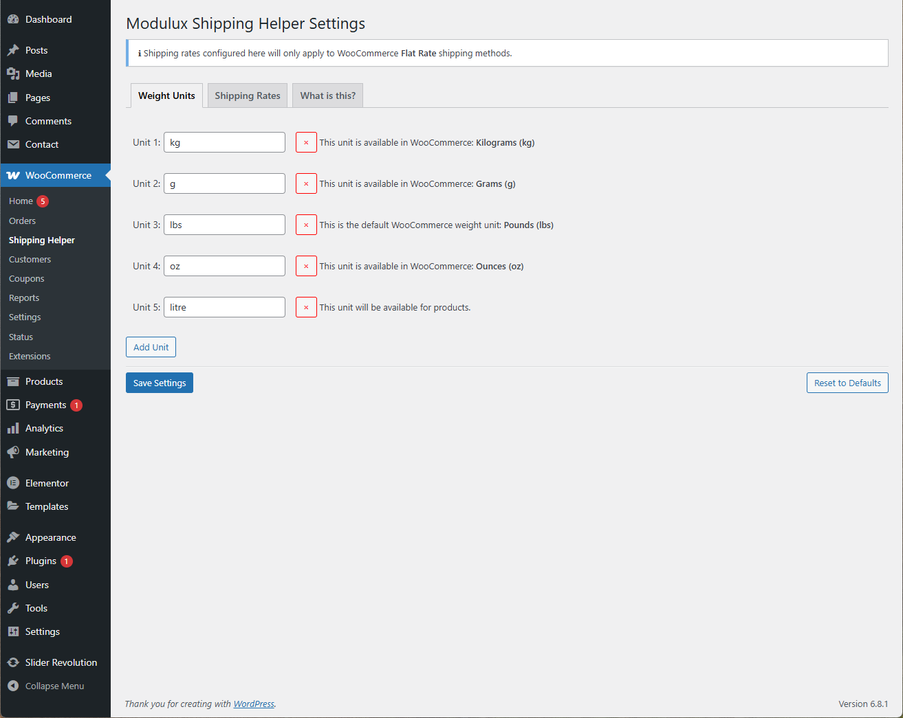
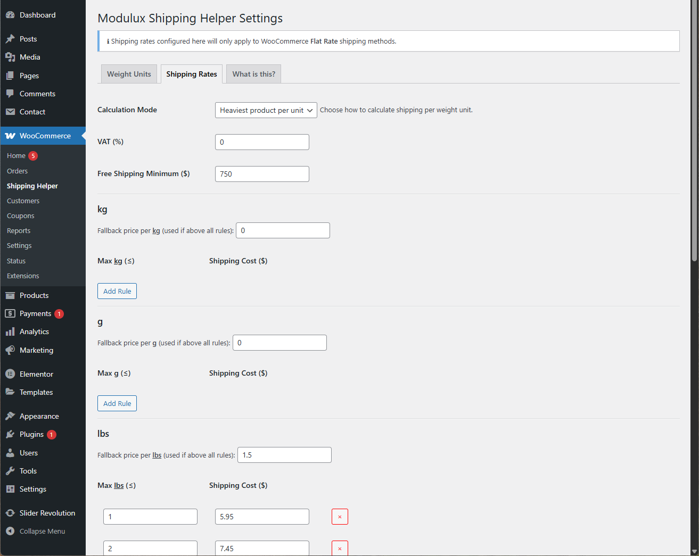
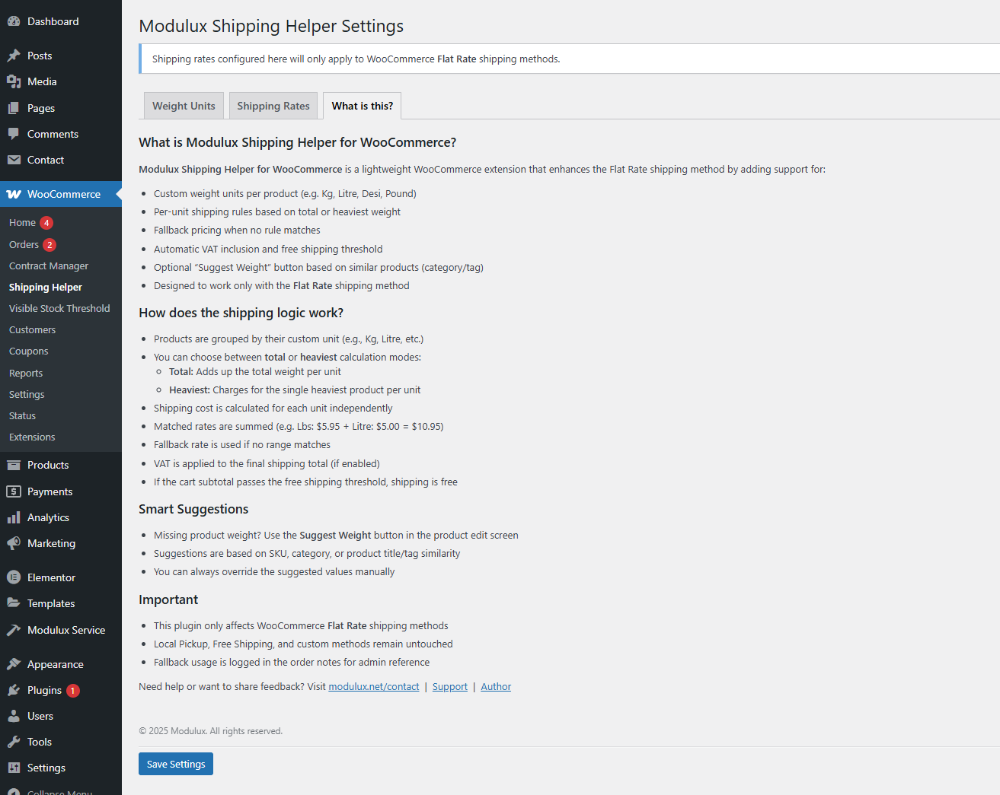
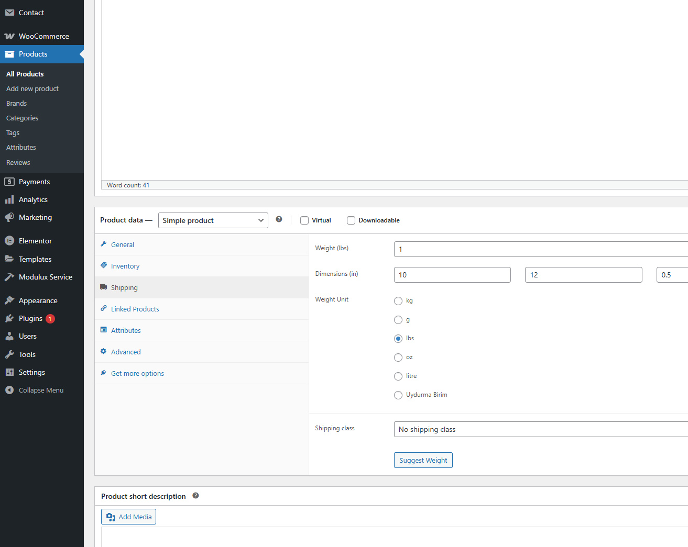
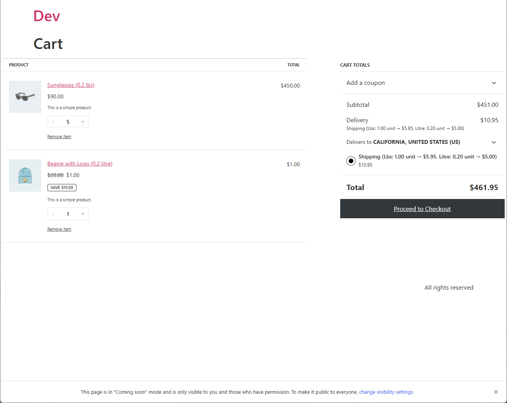

<<<<<<< HEAD
# modulux-shipping-helper
Enhances WooCommerce Flat Rate shipping by allowing per-product custom weight units, rule-based pricing, VAT, and smart calculation logic.
=======
# Modulux Shipping Helper for WooCommerce

**A powerful WooCommerce extension that enhances Flat Rate shipping by supporting custom weight units and smart rule-based pricing.**

---

## Features

- Define **custom weight units** per product (Kg, Lbs, Litre, Desi, etc.)
- Create **dynamic shipping rules** per unit (weight range → price)
- Choose between:
  - **Total Weight Mode**: sum of all weights per unit
  - **Heaviest Item Mode**: charges only for the heaviest item per unit
- Fallback pricing when no rule matches
- **Automatic VAT calculation** (if enabled)
- **Free shipping threshold** support
- AJAX-powered **Suggest Weight** button:
  - Suggests weight/unit based on SKU, category, or title keywords
- Flat Rate integration only – doesn't affect Local Pickup or Free Shipping

---

## Installation

1. Upload the plugin to `/wp-content/plugins/`
2. Activate it via the **Plugins** menu
3. Go to **WooCommerce → Shipping Helper** to configure units and rules

---

## Shipping Logic

1. Each product can have a **custom weight unit**
2. In the cart, products are **grouped by unit**
3. Per-unit weight is calculated based on mode:
   - **Total** → sum of all weights
   - **Heaviest** → max weight in that group
4. For each unit group:
   - The plugin checks your defined rules (`max weight → price`)
   - If a match is found, that price is used
   - If not, a fallback rate is applied (`weight × fallback`)
5. Shipping costs for all units are **added together**
6. VAT is applied if configured
7. If the cart subtotal exceeds the **free shipping threshold**, shipping is free
8. Fallback usage is logged in order notes for admin visibility

---

## Screenshots

### 1. Weight Units Management  

### 2. Per-Unit Shipping Rules and VAT  

### 3. “What is this?” Informational Tab  

### 4. Product Editing Screen  

### 5. Cart Preview with Custom Shipping

---

## FAQ

**Q: Does it work with Local Pickup or Free Shipping?**  
A: No. The plugin only affects Flat Rate shipping methods.

**Q: Can I define my own weight units?**  
A: Yes. You can add/remove units from the admin panel.

**Q: What if I don’t define rules for a unit?**  
A: The plugin will fall back to a per-weight rate if defined, or a default multiplier.

**Q: Is there a way to auto-fill missing product weights?**  
A: Yes. Use the 💡 Suggest Weight button in the product edit screen — it checks for similar SKUs, categories, or keywords.

---

## Changelog

### 1.0.0
- Initial release
- Support for custom units and per-unit shipping rules
- Total/Heaviest calculation modes
- VAT and free shipping threshold
- Smart weight suggestion button

---

## License

**GPL v2 or later**  
https://www.gnu.org/licenses/gpl-2.0.html

---

## Credits

Crafted by [Modulux](https://modulux.net) — creators of premium WordPress plugins and themes.
>>>>>>> 866c434 (Initial commit)
